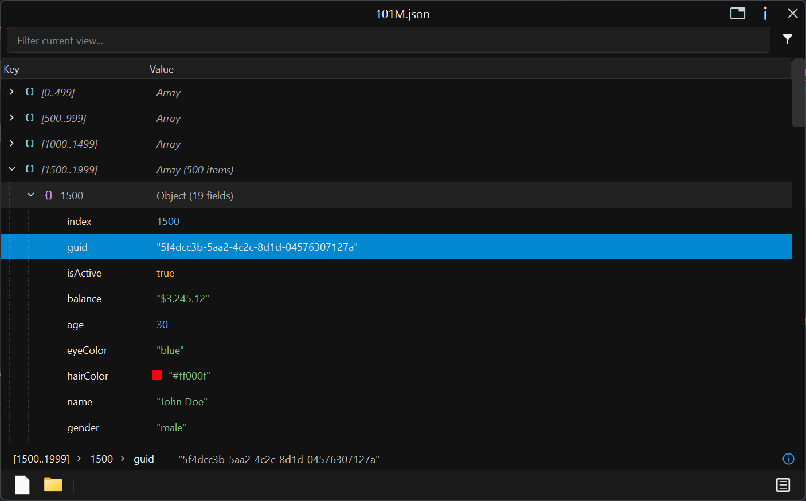

# JsonTreeViewer

**A high-performance JSON viewer and editor for Windows** — built as a native plugin for [Seer](https://1218.io), the quick-look file preview tool.

## Screenshots



JsonTreeViewer is a professional-grade JSON tree viewer and navigator built with C++ and Qt 6, powered by [simdjson](https://github.com/simdjson/simdjson/) 4.6.3 for blazing-fast parsing. Designed specifically for **[Seer](https://1218.io)** users who need to preview, navigate, and analyze large JSON files instantly — without opening a full IDE.

**Perfect for developers, data engineers, and anyone working with JSON APIs, config files, or data exports on Windows.**

## Features

### 🚀 Performance & Core Experience

- **Ultra-large file support with pagination**: Handles massive JSON files efficiently using strategy-based loading, lazy parsing, and memory-mapped I/O (Windows-optimized). Virtual pagination for giant arrays ensures smooth navigation even with millions of entries.
- **Async multi-threaded search engine**: Search runs in background threads, keeping the UI responsive during intensive operations. Real-time navigation to search results while indexing continues.
- **Interactive breadcrumb navigation**: IDE-style breadcrumb bar in the status area for quick navigation through deeply nested JSON structures, with path display and node statistics.

### 🎨 Visual & UI Enhancements

- **Premium visual styling**: Indent guide lines, syntax highlighting for strings/numbers/booleans, and Material Design theme-aware icons for a professional look.
- **Inline color preview**: Hex and RGB color values display with visual color chips directly in the tree view.
- **High-DPI & theme adaptation**: Fully rewritten DPI scaling logic ensures crisp rendering on 4K displays and all scaling factors. Seamless light/dark theme support.
- **Enhanced status bar metrics**: Detailed file metrics display with rich tooltips showing full path previews and data statistics.

### 🛠️ Interaction & Productivity

- **Deep copy & export**: Right-click menu includes "Copy Dot Path", "Copy Key/Value Only", and "Export Selected Fragment" for efficient data extraction.
- **Customizable shortcuts**: Configure keyboard shortcuts for common operations (e.g., Tab to toggle modes) to match your workflow.
- **Optimized search experience**: Search results now display type icons with improved typography and font rendering for quick data type identification.

### 🔧 Stability & Error Handling

- **Precise parse error reporting**: Invalid JSON now shows exact error location with visual guidance, not just vague messages.
- **Critical bug fixes**: Resolved UI freeze/deadlock issues with empty objects `{}` and fixed escape character parsing anomalies.
- **Memory optimization**: Memory-mapped direct subtree extraction significantly reduces memory spikes when copying large data blocks.

**This release transforms JsonTreeViewer from a simple viewer into a professional JSON processing tool**, solving the pain points of large data performance and deep navigation.

## Building and Running

Requirements: Qt 6.8, CMake 3.16+.

1. **Clone the Repository**

   ```bash
   git clone https://github.com/ccseer/JsonTreeViewer.git
   cd JsonTreeViewer
   ```

2. **Build**

   ```bash
   cmake -B build
   cmake --build build
   ```

   This produces two outputs:
   - `jsontreeviewer.dll` — the Seer plugin
   - `test_jsontreeviewer.exe` — standalone viewer for testing

3. **Install the plugin**

   Copy `jsontreeviewer.dll` to your Seer plugins directory.

## Use with Seer

**[Seer](https://1218.io)** is the ultimate quick-look file preview tool for Windows — press Space on any file to instantly preview it without opening a full application. JsonTreeViewer extends Seer with professional JSON viewing capabilities.

**The perfect workflow:**

1. Browse files in Windows Explorer
2. Press **Space** on any `.json` file
3. Instantly preview, navigate, and search JSON data in a beautiful tree view
4. No need to open VS Code, Notepad++, or any heavy editor

**Why this matters:**

- **Instant preview**: See JSON structure in milliseconds, not seconds
- **Stay in flow**: No context switching between Explorer and your editor
- **Handle any size**: From tiny config files to multi-GB API responses
- **Professional tools**: Breadcrumb navigation, syntax highlighting, color previews, and more

**Get started:**

1. Download **[Seer](https://1218.io)** — the quick-look tool for Windows
2. Install JsonTreeViewer plugin (see instructions below)
3. Press Space on any JSON file to preview instantly

Visit **[1218.io](https://1218.io)** to download Seer and explore the full plugin ecosystem.
